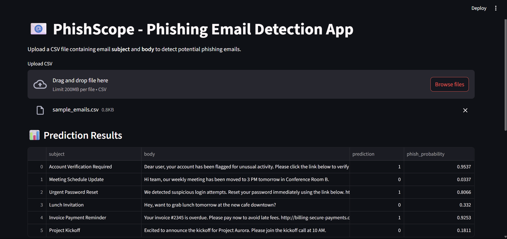
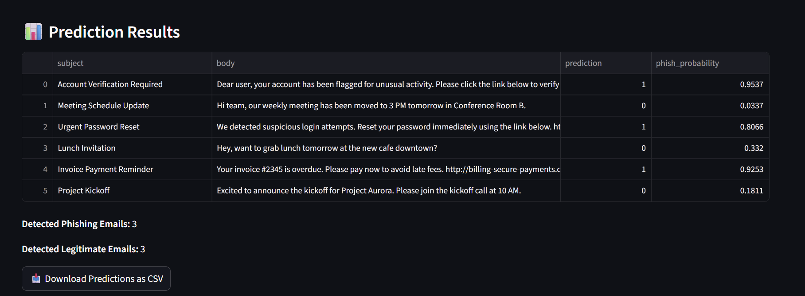
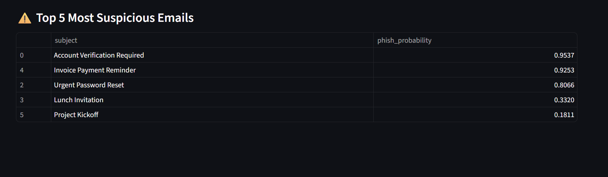

# 📧 PhishScope – AI-Powered Email Phishing Detection

> **End-to-end phishing email detection pipeline** combining **NLP, Machine Learning, and Business Intelligence** for real-world cyber defense.  
> Includes **cross-domain evaluation**, an **interactive Streamlit app**, and an **optional Power BI dashboard** for analytics.

---

## 🚀 Why This Project Matters
Phishing is one of the **top cybersecurity threats worldwide**, costing businesses over **$10.1 billion in 2022** (FBI IC3 Report).  
Most ML models detect phishing well on their training data but **fail in the real world** when new attack patterns emerge.

**PhishScope** solves this by:
- Using **historical** and **synthetic modern phishing emails**.
- Performing **cross-domain evaluation** to measure real-world generalization.
- Providing **interactive tools** for analysts and decision-makers.

---

## 📊 Project Highlights
✅ **Real-world business framing** – Simulates a SOC (Security Operations Center) analyst's workflow.  
✅ **End-to-end pipeline** – From raw data → insights → model → dashboard.  
✅ **Cross-domain testing** – Shows true model robustness to unseen phishing styles.  
✅ **Interactive Streamlit app** – Upload and scan emails with probability scoring.  
✅ **Power BI dashboard** – Visual insights for management and security teams.

## 📂 Project Structure
```text
PhishScope/
│
├── app/                        # Streamlit app
├── charts/                     # Plots, figures, screenshots
├── dashboard/                  # Power BI files & CSV
├── data/                       # Sample datasets
├── models/                     # Saved ML models
├── notebooks/                  # EDA Jupyter notebooks
├── scripts/                    # Data processing & training scripts
├── README.md                   # Project documentation
└── requirements.txt            # Dependencies


## 🛠 Tech Stack
**Languages:** Python, DAX (Power BI)  
**ML/NLP:** scikit-learn, TF-IDF, Logistic Regression  
**Data Analysis:** pandas, matplotlib, seaborn  
**App Framework:** Streamlit  
**BI & Dashboarding:** Power BI  
**Version Control:** Git, GitHub

---

## 📈 Model Performance

### **Cross-Domain Evaluation**
| Train Dataset   | Test Dataset    | Accuracy | Precision (Phish) | Recall (Phish) | ROC-AUC |
|-----------------|----------------|----------|-------------------|----------------|---------|
| Kaggle          | Synthetic      | 63%      | 0.59              | 0.94           | 0.877   |
| Synthetic       | Kaggle         | 61%      | 0.91              | 0.00           | 0.605   |

**Insight:**  
- Good performance within known domain.  
- Significant drop in reverse test → highlights **concept drift** and the need for continuous retraining.

---

## 🖥 Streamlit App
Upload a CSV of emails with `subject` and `body` columns → get:
- **Phishing probability** for each email.
- **Binary prediction** (Phish / Legit).
- **Top suspicious emails**.
- Downloadable prediction CSV.

---

## 📷 Streamlit App Screenshots
<p float="left">
  
  
  
</p>

---

## ⚡ Run Locally
```bash
# Clone repository
git clone https://github.com/poojap13/PhishScope-Email-Phishing-Detection.git
cd PhishScope-Email-Phishing-Detection

# Create virtual environment
python -m venv phishscope_env

# Activate (Windows PowerShell)
phishscope_env\Scripts\activate

# Install dependencies
pip install -r requirements.txt

# Run Streamlit app
streamlit run app/app.py
📊 Power BI Dashboard (Optional)
Features:

% of phishing vs legitimate emails.

Top sender domains.

Keyword frequency & suspicious term analysis.

Link count vs phishing probability correlation.

🧠 Key Learnings
Cross-domain testing is critical for security ML models.

Synthetic data can simulate emerging threats but requires careful validation.

Visualization (BI) bridges the gap between data scientists and decision-makers.

📜 License
MIT License – feel free to use, modify, and share with attribution.


